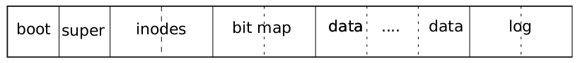

# Predavanje 1 (Uvod u fajl sisteme)

Sistemski pozivi koji se koriste za interakciju sa hardvetom (ne trebaju nam sada, ignorisati): \
`select` sistemski poziv (noviji se zasnivaju na njemu) \
`epoll` -> `io_uring` (moderni `select` u Linux OS-u)

Disk služi za trajnu pohranu podataka i ima sličan interface kao i RAM (ima random access read i write), s tim da: \
RAM - pristup na nivou bajta* (1B)  \
Disk - **pristup na nivou sektora (obično 512B)** \
\**(tehnički cache linije, ali ok je razmišljati da je na nivou bajta)*

Diskovi genelrano podržavaju dvije operacije: `get` i `set`.
Obično se moze više tih operacija izvršiti kao `batch`.
Brže je dohvatiti `n` sektora putem `batch` operacije nego `n` sektora *"jedan po jedan"*.

**Fajl sistem** je data struktura za organizaciju podataka na uređajima za trajnu pohranu podataka.

**Fajl** je logička jedinica podataka koja sadrži informacije koje je kreirao neki proces.

Kako i gdje se pohranjuju podaci na disk diktira isključivo OS, korisnik nema kontrole nad tim (u koje sektore če fajl biti smješten i slično).

Za analizu fajl sistema u sklopu ovog predmeta koristimo **fajl sistem od XV6** OS-a, koji je sličan EXT3 fajl sistemu.
Moderni Linux sistemi koriste **EXT4**, BTRFS i XFS fajl sisteme.
U daljoj analizi se podrazumijeva da govorimo o XV6 fajl sistemu, ali koncepti se primjenjuju generalno na sve fajl sisteme.

### XV6 fajl sistem

XV6 fajl sistem se sastoji od 6 sekcija:
- `boot` - bootloader
- `super` - metapodaci o fajl sistemu
- `inodes` - niz `inode` struktura
- `bitmap` - bit mapa slobodnih `data` sektora
- `data` - niz sektora koji sadrže podatke
- `log` - koristi se za logiranje akcija fajl sistema, ovo nećemo prelaziti



Prvi sektor u fajl sistemu je **`boot`** blok gdje se nalazi bootloader.
Pored bootloadera u tom sektoru se nalazi i mapa particija, ali nećemo o njoj govoriti.

Obično prvi sektora nakon `boot` bloka je **`super`** blok.
U tom bloku se nalaze informacije koliko su velike ostale sekcije.

Proces **formatiranja** je kreiranje default data strukture na disku koja predstavlja fajl sistem.
Ovime se **ne brišu** podaci koji su prethodno bili tu u `data` sekciji.

Nakon `super` bloka se nalazi **`inode`** sekcija.
Ovo je efektivno niz `inode`-ova.

Generalno, `inode` je `struct` koji pored ostalih metapodataka ima "pointer"* na podatke u data sekciji koje opisuje. \
\**(niz pointera)*

Za sada ćemo analizirati dvije vrste `inode`-a: *fajl* i *direktorija*.

Svaki bit **`bitmap`** block sekcije je povezan sa jednim sektorom iz data blok sekcije.
`0` znači da je sektor slobodan, a `1` da je sektor zauzet.
Dakle, ako je 10. bit `bitmap` sekcije `1`, to znači da je 10. sektor `data` sekcije zauzet, a ako je `0` to znači da je slobodan.

O **`log`** bloku nećemo govoriti (možda spomenemo kratko), ali koristi se za logovanje i omogućava prevenciju gubitka podataka prilikom "nasilnog" zaustavljanja korištenja diska (kao npr. vađenje USB stick-a prilikom transfera podataka; FAT32 fajl sistem ovo nema i ako se ovo desi na njemu postoji mogućnost gubitka svih podataka na disku).

### `inode`

`inode` struct izgleda ovako:
```c
struct dinode {
  short type;              // File type
  short major;             // Major device number (T_DEV only)
  short minor;             // Minor device number (T_DEV only)
  short nlink;             // Number of links to inode in file system
  uint size;               // Size of file (bytes)
  uint addrs[NDIRECT+1];   // Data block addresses 
};
```
gdje je `NDIRECT` definisan kao `12`.

Dakle, sastoji se od sljedećih polja:
- `type` - vrsta `inode`-a
- `major`
- `minor`
- `nlink`
- `size` - količina podataka sa kojima je dati `inode` asociran izražena u bajtima
- `addrs` - niz adresa sektora u `data` sekciji na kojima se nalaze podaci asocirani sa datim `inode`-om

Sljedeće preskačemo za sad:
- `major` i `minor` se koristi za uređaje
- `nlink` se koristi za hardlink-ove

Polje **`type`** može biti*:
- `0` što govori da dati `inode` nije asociran sa podacima ("prazan" je)
- `T_FILE` - `inode` je asociran sa fajlom
- `T_DIR` - `inode` je asociran sa direktorijom
- `T_DEV` - nismo spominjali \
\**(ovo pišem iz sjećanja jer profesor još nije postavio prezentacije, provjeriti na prezentaciji još jednom ako ja zaboravim)*

Pretpostavimo da je `type` nekog `inode` `T_FILE`.
Polje **`addrs`** predstavlja niz adresa koje pokazuju na `data` sekciju gdje se nalazi taj fajl.

Prvih `NDIRECT` (`12`) adresa su **direktne** i direktno pokazuju na podatke fajla na disku.
Dakle, `addrs[0]` pokazuje na prvi sektor u koji je fajl upisan, `addrs[1]` drugi sektor, itd.
Na osnovu ovoga može se zaključiti da fajl može imati maksimalnu veličinu od `12 * 512B = 6kB`.
Ovo je veoma malo čak i za tekstualne fajlove, pa se zadnja adresa (onaj `+1` iz `NDIRECT+1`) koristi kao nivo indirekcije.

Zadnja adresa iz `addrs` ne pokazuje na podakle od fajla, nego na sektor koji sadrži adrese koje pokazuju na ostale sektore u kojima se nalazi fajl.
Ako je fajl veći od `6kB`, mora zauzeti više od `12` (`NDIRECT`) sektora.
U tom slučaju, adrese sektora koji sadrže prvih `6kB` fajla se zapisuju u `addr[0]` do `addr[NDIRECT-1]`, a ostale se zapisuju u neki drugi slobodan sektor na disku u `data` sekciji. Zadnja adresa u nizu `addrs` pokazuje na taj sektor (gdje su ostale adrese), pa se time javlja nivo indirekcije.

Svaka adresa je `4B` *(pretpostavljajući `32b` adrese)*, a sektor je `512B`, pa on može pohraniti `128` adresa.
Svaka od tih adresa pokazuje na sektor od `512B`, a ima ih `128` pa dobijamo `128 * 512B = 64kB`.
Na kraju dodavajući `6kB` na koje pokazuju prvih `12` adresa iz `addrs` dobijamo činjenicu da je maksimalna veličina fajla u XV6 fajl sistemu **`70kB`**. Slična ograničenja imaju i drugi fajl sistemi (npr. FAT32 ima maksimalnu veličinu fajla od `4GB`). Za moderne fajl sisteme ovo (bar trenutno) nije problem jer imaju velika ograničenja (npr. EXT4 ima ograničenje od `16TB`).


#### Dodatni resursi:
- [YouTube video za inode](https://www.youtube.com/watch?v=ScDv02ff8oc)
- *[XV6 fajl sistem - pekopeko1](https://pekopeko11.sakura.ne.jp/unix_v6/xv6-book/en/File_system.html)
- *[XV6 fajl sistem - Brian Pan](https://ppan-brian.medium.com/file-systems-in-xv6-8603fdd33dd6)
- *[XV6 fajl sistem - Mythili Vutukuru](https://www.cse.iitb.ac.in/~mythili/os/notes/old-xv6/xv6-filesystem.pdf)

\**(nisam čitao ali se na prvi pogled čine ok)*
