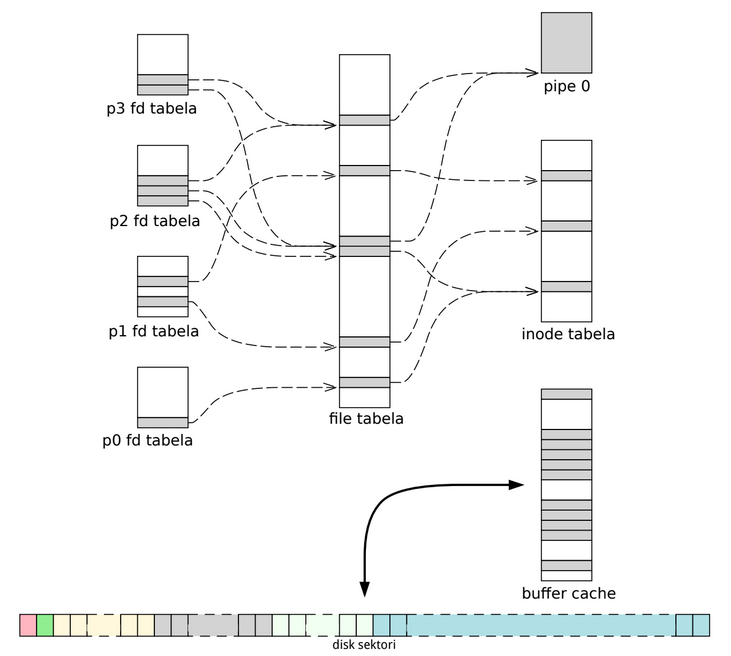

### Sadržaj
- [`sudo`](#sudo)
- [Set gid bit](#set-gid-bit)
  - [Primjer](#primjer-direktorija-sa-set-gid-bit)
- [Sticky bit](#sticky-bit)
  - [Primjer za `/tmp` direktoriju](#primjer-za--tmp-direktoriju)
  - [Primjer za user-owned direktoriju](#primjer-za-user-owned-direktoriju)
  - [Primjer za root-owned direktoriju](#primjer-za-root-owned-direktoriju)
- [Default permisije](#default-permisije)
- [Načini izvršavanja skripti](#načini-izvrsavanja=skripti)
  - [Primjer](#primjer-razlicitih-nacina-izvrsavanja)
- [Fajl sistem kernel tabele](#fajl-sistem-kernel-tabele)
- [`init` fajl deskriptori](#init-fajl-deskriptori)
- [Dodatni resursi](#dodatni-resursi)

---

### `sudo`

**Kredencije** - u ime koga se izvršava proces (`euid`, `ruid`, itd.)

Za eskalaciju privilegija pri izvršenju proizvoljnog programa se koristi utility `sudo`.
Argument je putanja do drugog programa.
`sudo` radi `fork`, pronađe proslijeđeni program i uradi `exec` na taj program.

Kreiranje novog user-a se vrši dodavanjem entry-a u `/etc/passwd` i `/etc/shadow`.

Svaki novi user treba da ima *home* direktoriju i da u nju kopira sve što se nalazi u direktoriji `/etc/skel/`.
U toj direktoriji se nalazi *default* konfiguracija za user-a.

Kako bi user mogao izvršiti `sudo` mora bidi *sudoer*.
Konfiguracija za *sudoer* user-e se nalazi na više mijesta, ali je glavna konfiguracija u `/etc/sudoers`.
Dio konfiguracije je u `/etc/sudo.conf`, a dio u `/etc/sudoers.d/`.
Namijenjeno je da se fajl `/etc/sudoers` ne mijenja, nego se dodatna konfiguracija radi u `/etc/sudoers.d`.
Ono sto počinje sa `%` označava grupu.


### Set gid bit

**Set gid bit** ima smisla samo kada se koristi na direktorijama, jer se na fajlovima ignoriše.
Ako se pravi link u direktoriji koja ima set gid bit, napravljeni linkovi će imati grupu koja je grupa od direktorije, a ne od korisnika u ime kojeg se pravi inode.
`ls` ga prikazuje kao `s` na mjestu group execute permisije (ili `S` ako inode nema execute permisiju).

Set gid bit se aktivira sa `chmod g+s putanja`.

#### Primjer direktorija sa set gid bit
``` bash
mkdir gidbit
chmod g+s gidbit    # postavlanje set gid bit-a
cd gidbit
sudo touch foo      # kreiranje fajla foo u ime root korisnika
ls -l               # foo ima grupu istu kao i trenutni korisnik (bez set gid bit-a bi bila root)
```


### Sticky bit

**Sticky bit** ograničava brisanje fajlova unutar direktorije koja ima set-ovan sticky bit.
Koristi se samo na direktorijima, jer se na fajlovima ignoriše*.

\**Historijski se koristio na fajlovima da "zalijepi" izvršni fajl u swap space, odakle mu ime i potiče. Swap space je ukratko dio diska koji se koristi za brži pristup fajlovima. Danas ovo više nije podržano.*

Sticky bit se dodaje pomoću `chmod +t putanja` i reprezentira se sa `t` u ispisu `ls` utility-a.

Brisati fajlove u direktoriji koja ima set-ovan sticky bit može:
- vlasnik fajla
- vlasnik direktorije koja je označena sa sticky bit-om
- root korisnik

`/tmp/` postoji jer ima potreba za folderom gdje svi procesi mogu pisati.
Ova direktorija ima sve permisije dozvoljene za sve korisnike i ima sticky bit set-ovan.

`mktemp` pravi novi fajl u `/tmp/` koji ima unikatno ime.
Ako se doda `-d` flag pravi se direktorija.

#### Primjer za `/tmp` direktoriju
``` bash
cd /tmp

# kreiranje testnih fajlova
touch user_file         # kreiraj fajl user_file u ime trenutnog korisnika
sudo touch root_file    # kreiraj fajl root_file u ime root korisnika

# pokušaj brisanja fajlova u ime trennutnog korisnika
rm user_file            # ok, jer vlasnik briše fajl
rm root_file            # error, jer je vlasnik root

# ponovno kreiranje testnih fajlova
touch user_file
sudo touch root_file

# pokušaj brisanja fajlova u ime root korisnika
sudo rm user_file       # ok, jer root uvijek može izbrisati fajl
sudo rm root_file       # ok, jer je root vlasnik
```

Alternativno je moguće koristiti `chown` za promjenu vlasnika:
- `chown $USER path` - promijeni vlasnika inode-a na putanji `path` na trenutnog korisnika (potrebno `sudo` ispred `chown` ako trenutni korisnik nije vlasnik inode-a)
- `sudo chown root path` - promijeni vlasnika inode-a na putanji `path` na root korisnika

#### Primjer za user-owned direktoriju
``` bash
mkdir sticky_user       # kreiraj direktoriju sticky_user
chmod +t sticky_user    # aktiviraj sticky bit na direktoriji sticky_user

touch foo               # kreiraj fajl foo u ime trenutnog korisnika
sudo touch bar          # kreiraj fajl bar u ime root korisnika

rm foo                  # ok jer je trenutni korisnik vlasnik fajla
rm bar                  # ok jer je trenutni korisnik vlasnik sticky_user direktorije
```

#### Primjer za root-owned direktoriju
``` bash
mkdir sticky_root               # kreiraj direktoriju sticky_root
sudo chown root sticky_root     # promijeni vlasnika direktorije na root korisnika
sudo chmod +t sticky_root       # aktiviraj sticky bit na direktoriji sticky_root

touch foo                       # kreiraj fajl foo u ime trenutnog korisnika
sudo touch bar                  # kreiraj fajl bar u ime root korisnika

rm foo                          # ok jer je trenutni korisnik vlasnik fajla
rm bar                          # error, jer trenutni korisnik nije vlasnik niti fajla, niti sticky_root direktorija
```

Alternativno kreiranje `sticky_root` direktorije se moglo izvršiti kao `sudo mkdir sticky_root`,
pri čemu bi `sticky_root` direktorija imala root korisnika i root grupu kao vlasnika, pa nema potrebe raditi `chown`.


### Default permisije

Default permisije za svaki novo-kreirani inode se računju koristeći `umask`.
`umask` je 4-cifreni oktalni broj (`BUGO`) koji se može pročitati koristeći `umask` komandu, gdje je:
- `B` - prva 3 bita, predstavlja stanje set uid, set gid i sticky bita (`---B--B--B`)
- `U` - druga 3 bita, predstavlja stanje owner (user) permisija (`-UUU------`)
- `G` - treća 3 bita, predstavlja stanje group permisija (`----GGG---`)
- `O` - zadnja 3 bita, predstavlja stanje other permisija (`-------OOO`)

`umask XYZ` - postavljanje umask na `XYZ` (gdje je `XYZ` npr. `023`)

Ako se neka cifra izostavi podrazumijeva se da je `0`.
Npr. `umask 22` je isto što i `umask 022` ili `umask 0022`.

Za fajlove, permisije se računaju kao (`6` - `umask` cifra) za svaki tip permisija (user, group i others).
Ako se dobije neparan broj doda se 1.
U prevodu, ako se dobije execute privilegija isključuje se.
Ovo znači da novo-kreirani fajl nikada neće imati execute permisiju.
Ako je umask cifra za neku vrstu permisije `7` tada fajl nema ni jednu permisiju (`0`).
Za direktorij oduzima se od 7 i nema pravila da se execute privilegija na neki način mijenja.

Primjer:
``` bash
umask 022
touch foo   # -rw-r--r--
            # 6 - 0 = 6 (rw-)
            # 6 - 2 = 4 (r--)
            # 6 - 2 = 4 (r--)
umask 123
touch bar   # -rw-r--r--
            # 6 - 1 = 5 neparan, dodaje se 1 pa je zapravo 6 (rw-)
            # 6 - 2 = 4 (r--)
            # 6 - 3 = 3, neparno, zapravo 4 (r--)
umask 765
touch tar   # --------w-
            # 6 - 7 = -1 neparan, zapravo 0 (---)
            # 6 - 6 = 0 (---)
            # 6 - 5 = 1 neparan, zapravo 2 (-w-)
```


### Načini izvršavanja skripti

Kada se neka skripta `foo.sh` pokreće sa `bash foo.sh` ili `./foo.sh`, bash (shell) radi `fork` i `exec`.
Alternativa tome je `source foo.sh` pri čemu bash (shell) ne radi fork, nego bash (shell) proces u kojem je izvršena komanda interpretira kod skripte liniju po liniju.
Posljedica ovoga je da nakon `source foo.sh` u shell-u ostaju sve lokalne varijable i izmjene environment varijablama, dok za `./foo.sh` ili `bash foo.sh` to nije slučaj.

Prilikom pokretanja bash shell-a izvršava se `source ~/.bashrc`.

#### Primjer različitih načina izvršavanja

Korištena skripta `foo.sh`:
``` bash
#!/usr/bin/env bash

test="Hello test"
export TEST="Hello TEST"

echo "Script - $test"
echo "Script - $TEST"
```

Koristeći `./foo.sh`:
``` bash
mahir@mahir:~$ ./foo.sh     # radi fork pa exec
Script - Hello test
Script - Hello TEST
mahir@mahir:~$ echo $test   # lokalna varijabla test ne postoji

mahir@mahir:~$ echo $TEST   # environment varijabla test ne postoji

mahir@mahir:~$
```

Koristeći `source foo.sh`:
``` bash
mahir@mahir:~$ source foo.sh
Script - Hello test
Script - Hello TEST
mahir@mahir:~$ echo $test
Hello test
mahir@mahir:~$ echo $TEST
Hello TEST
mahir@mahir:~$
```


### Fajl sistem kernel RAM elementi

Postoje tri glavne tabele u RAM-u koje kernel koristi:
- fajl deskriptor (fd) tabela
- fajl tabela
- inode tabela



*Buffer cache nismo spominjali, ali predstavlja cache disk sektora koje kernel kopira sa diska u memoriju zbog bržeg pristupa.
Prilikom zahtjeva pristupu nekom sektoru kernel prvo provjerava buffer cache, 
pa ako u njemu ne nađe tražene sektore onda ih traži na disku.*

*Pipe također nismo (još) spominjali, ali ukratko predstavlja mehanizam putem kojeg procesi mogu komunicirati na način koji liči na pisanje i čitanje fajla. To je dakle vrsta IPC (Inter-Process Communication). Jedan proces piše u pipe dok drugi proces čita iz pipe-a.*

Tabela inode-a predstavlja tabelu kopija disk inode-ova koji su trenutno aktivni (otvoreni).
Ovo je praktično cache inode struktura koje kernel čita sa diska i pohranjuje u memoriji.

**Fajl tabela** (također se naziva i *global open file table*) predstavlja kolekciju svih otvorenih fajlova u cijelom operativnom sistemu.

**Fajl** je struktura koja se nalazi u fajl tabeli.
Fajl ima pointer na neki inode u inode tabeli.
Svaki fajl ima **offset** koji predstavlja lokaciju u odakle će se vršiti čitanje ili pisanje kada se bude koristio fajl objekat.
To čitanje i pisanje se vrši nad podacima koji su asocirani sa inode-om sa kojim je asociran fajl nad kojim se izvršava operacija.

Svaki proces ima fajl deskriptor tabelu.
**Fajl deskriptor tabela** je niz pointera u fajl tabelu.
Prilikom `fork`-anja fajl deskriptor tabela se kopira u child proces.

**Fajl deskriptor** na user strani je indeks reda u fajl deskriptor tabeli.
Svaki fajl deskriptor je asociran sa tačno jednim fajlom.
Fajl deskriptor kao element fajl deskriptor tabele (kernel strana) ima pointer u fajl tabelu.
Ako taj pointer nije `NULL` (pokazuje na fajl tabelu), to znači da je taj fajl deskriptor asociran sa nekim otvorenim fajlom.

Tabele su fiksne veličine, što znači da u jednom trenutku može biti otvoreno maksimalno neki predefinisani broj fajlova.

Dakle, svaki proces ima svoju fajl deskriptor tabelu.
Svaki entry (red) u toj tabeli predstavlja jedan fajl.
Ako pointer u tom entry-u nije `NULL` to znači da je taj fajl deskriptor asociran sa otvorenim fajlom.
Fajl tabela je lista otvorenih fajlova koji pokazuju na inode sa kojim su asocirani i imaju offset.
Offset se koristi (i mijenja) prilikom čitanja i pisanja.

Na prethodnoj slici može se primijetiti da neki fajl deskriptori pokazuju na iste fajlove i da neki fajlovi pokazuju na iste inode.

Ako dva fajl deskriptora pokazuju na isti fajl, to znači da je jedan od njih nastao putem `fork`-a od drugog, odnosno oni su parent i child proces.
Ovo je posljedica činjenice da se fajl deskriptor tabela prilikom `fork`-a kopira u child proces.

Ako dva fajla pokazuju na isti inode to znači da taj inode koriste oba fajla.
Pokazuju na isti inode jer je duplikacije inode-a redundantna.
Međutim, postojanje dva fajla koji pokazuju na isti inode nije redundantno.
To je zato jer fajl pored pointera na inode ima i offset koji je različit za različite procese.

Kernel zapisuje kod error-a u `errno` globalnu varijablu koja se može uključiti preko headera `errno.h`.

Syscall `open` se koristi za otvoranje fajlova.
Kao argumente uzima*:
- `pathname`
- `flags` - mod rada
- `mode` - npr. permisije

Jednom kada se validiraju kredencije i fajl biva otvoren više se ne provjeravaju permisije pri pristupu tom fajlu.

Pri otvoranju novog fajla koristi se prvi slobodan fajl deskriptor u fajl deskriptor tabeli od procesa koji ga otvara.


### `init` fajl deskriptori

Postoje tri fajla koji svaki* proces ima otvorene prilikom svog nastanka:
- `stdin` ima fajl deskriptor `0`
- `stdout` ima fajl deskriptor `1`
- `stderr` ima fajl deskriptor `2`

\**Eventualni izuzetak bi bio proces koji je kreiran putem `fork`-anja od procesa u kojem je neki od navedenih fajlova zatvoren.*

Prvi proces koji se kreira je `init`, kojeg kreira kernel.
Kada se `init` pokrene, on otvori tri fajla: `stdin`, `stdout` i `stderr`.
Svi procesi na UNIX sistemima su potomci `init` procesa, što znači da se ta tri fajl deskriptor-a se kopiraju u svaki proces prilikom `fork`-a od `init` procesa (i njegovih child procesa).

Relevantni kod `init` procesa od `xv6`:
``` c
int main(void)
{
                ...
  if(open("console", O_RDWR) < 0){
    mknod("console", 1, 1);
    open("console", O_RDWR);
  }
  dup(0);  // stdout
  dup(0);  // stderr
                ...
}
```

U kodu iznad, prilikom pokretanja `init` pokušava otvoriti fajl `"console"` koristeći `open`* sistemski poziv za čitanje i pisanje (`O_RDWR` - *Open for ReaD and WRite*).
Ukoliko ne uspije, on ga kreira koristeći `mknod` sistemski poziv i otvora.
Zatim duplicira fajl deskriptore koristeći `dup`** sistemski poziv.

\**`open` u xv6 ima malo drguačiji potpis u odnosu na UNIX (uzima samo putanju i flag).* \
\*\**`dup` uzima fajl deskriptor (indeks u fajl deskriptor tabeli) koji će se duplicirati.*

Inicijalno nema ni jednog fajl deskriptora pa zbog toga `open` će rezultovati da se koristi prvi fajl deskriptor (indeks `0`) koji predstavlja `stdin` i pokazuje na fajl koji predstavlja terminal.
Dupliciranjem njega (prvi `dup(0)`) se koristi naredni slobodan fajl deskriptor (indeks `1`) koji predstavlja `stdout` i pokazuje na isti fajl.
Ponovnim duplicitanjem `stdin` (drugi `dup(0)`) se koristi naredni slobodan fajl deskriptor (indeks `2`) koji predstavlja `stderr` i pokazuje na isti fajl kao i `stdin` i `stdout`.
Zbog ovoga `stdin`, `stdout` i `stderr` imaju fajl deskriptore `0`, `1` i `2` respektivno.

---

### Dodatni resursi
- [Special Linux Permissions (set uid, set gid i sticky bit)](https://www.youtube.com/watch?v=zU43cReOBsc)

---

**Side quest:** *find 5.25 floppy reader*
